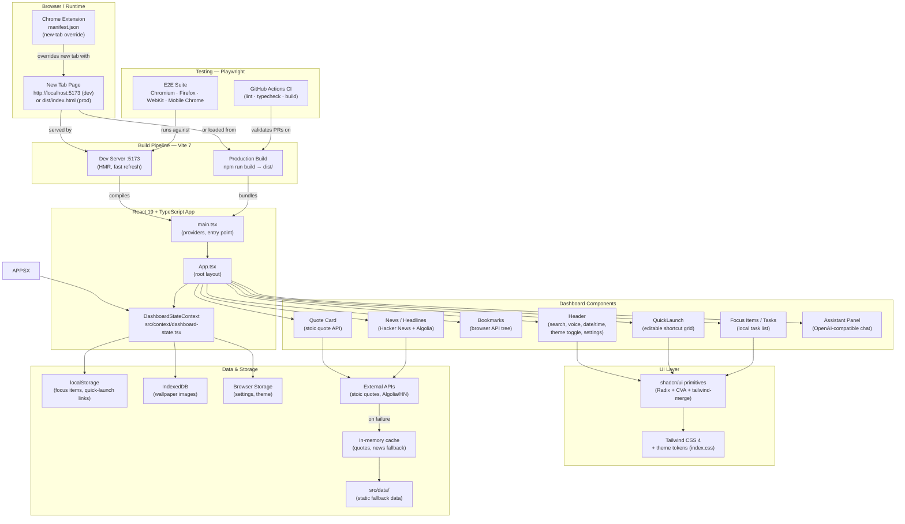
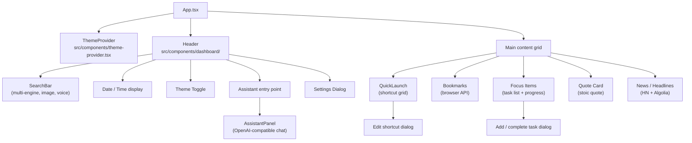

# Architecture — Dinam

Dinam is a React 19 + TypeScript personal dashboard intended as a new-tab replacement. This document describes how its major layers fit together, what each part owns, and which files matter most when you are making a change.

---

## System Flow

---

## Component Tree

---

## Layer-by-Layer Explanation

### Chrome Extension (manifest.json)
Dinam is designed to replace the browser new-tab page. A `manifest.json` placed in `public/` declares the `chrome_url_overrides.newtab` entry point so the browser loads `index.html` whenever a new tab is opened. **Note:** the current repository does not yet ship this manifest; the dashboard is fully functional as a regular web page in the meantime (see [Browser Extension Status](../README.md#browser-extension-status)).

### Vite 7 Build Pipeline
Vite handles the dev server (port 5173 with HMR) and the production bundle (`dist/`). TypeScript compilation (`tsc --noEmit`) runs as part of `npm run build` so type errors block the build. The `@/` path alias maps to `src/`, keeping imports clean across the codebase.

### React 19 + TypeScript App
`main.tsx` mounts the React tree and wraps it with providers (theme, dashboard state). `App.tsx` assembles the responsive grid layout. All global state — theme, settings, focus items, quick-launch links — lives in `DashboardStateContext` (`src/context/dashboard-state.tsx`) rather than being scattered across components.

### Dashboard Components (`src/components/dashboard/`)
Each dashboard section is a self-contained component that reads from context or its own hook. Components do not reach into sibling components; cross-cutting needs go through context or shared hooks (`src/hooks/`).

| Component | Responsibility |
|---|---|
| `Header` | Search (multi-engine, image, voice), date/time, theme toggle, settings entrypoint, assistant toggle |
| `QuickLaunch` | Editable shortcut grid; fetches favicons and metadata per link |
| `Bookmarks` | Renders the browser bookmark tree; gracefully absent when the API is unavailable |
| `Focus Items` | Local task list; stores state in `localStorage` |
| `Quote Card` | Fetches a daily stoic quote; falls back to `src/data/` on network failure |
| `News / Headlines` | Pulls from Hacker News via Algolia API; local cache prevents redundant fetches |
| `AssistantPanel` | OpenAI-compatible chat; endpoint and key configured in settings |

### shadcn/ui + Tailwind CSS 4
UI primitives (buttons, dialogs, inputs, etc.) are added via the shadcn CLI and live in `src/components/ui/`. They are Radix-based, class-variance-authority–styled, and merged with `tailwind-merge`. Theme tokens are defined in `index.css` and referenced by Tailwind classes throughout. New components should be added through `npx shadcn@latest add <component>` rather than written from scratch.

### Data & Storage
Dinam avoids a backend entirely; all persistence is client-side:

| Store | What lives there |
|---|---|
| `localStorage` | Focus items, quick-launch links |
| `IndexedDB` | Compressed wallpaper images |
| Browser storage (extension) | Settings, theme preference |
| In-memory cache | Fetched quotes and news (avoids redundant API hits) |
| `src/data/` | Static fallback data served when network calls fail |

### Playwright E2E Tests
Tests live alongside the source and run against the Vite dev server. The suite covers dashboard rendering, task creation, and theme persistence across reloads. Tests execute on Chromium, Firefox, WebKit, and Mobile Chrome (Pixel 5).

CI (GitHub Actions) validates PRs with lint, typecheck, and production build jobs. Playwright tests run locally via `npm run test:e2e`; they are not yet wired into the CI pipeline.

---

## Dev Mode vs. Extension Mode

| | Dev mode | Extension mode |
|---|---|---|
| Entry point | `http://localhost:5173` | `chrome://newtab` (via `manifest.json`) |
| Asset serving | Vite dev server (HMR) | Static files from `dist/` |
| How to run | `npm run dev` | Build → load unpacked in `chrome://extensions` |
| Browser APIs (bookmarks, etc.) | Unavailable or limited | Available when extension permissions are granted |
| Hot reload | Yes | No — requires rebuild and extension reload |

---

## Key Files for New Contributors

| File / Directory | What it does |
|---|---|
| `src/main.tsx` | React entry point; mounts providers |
| `src/App.tsx` | Root layout; assembles the dashboard grid |
| `src/context/dashboard-state.tsx` | Single source of truth for global state |
| `src/components/dashboard/` | One file per dashboard section |
| `src/components/ui/` | shadcn/ui primitives — don't edit by hand; use CLI |
| `src/hooks/` | Browser API hooks, news fetch, dashboard behaviour |
| `src/lib/` | Storage helpers, search engine config, AI client, theme utils |
| `src/data/` | Static fallback data (quotes, news, bookmarks) |
| `src/types/` | Shared TypeScript types |
| `index.css` | Tailwind config, CSS custom properties, theme tokens |
| `vite.config.ts` | Build config, `@/` alias, plugins |
| `e2e/` | Playwright test files |
| `public/manifest.json` | Chrome extension manifest *(not yet present — see extension status)* |

---

## Adding a New Dashboard Widget

1. Create `src/components/dashboard/my-widget.tsx`.
2. If the widget needs persistent state, add it to `DashboardStateContext`.
3. If it needs a browser API, guard the call (the API may be absent outside the extension).
4. Register the component in `App.tsx` inside the appropriate grid area.
5. Add or extend a Playwright test in `e2e/` covering the core interaction.
6. Run `npm run lint && npm run typecheck` before opening a PR.
